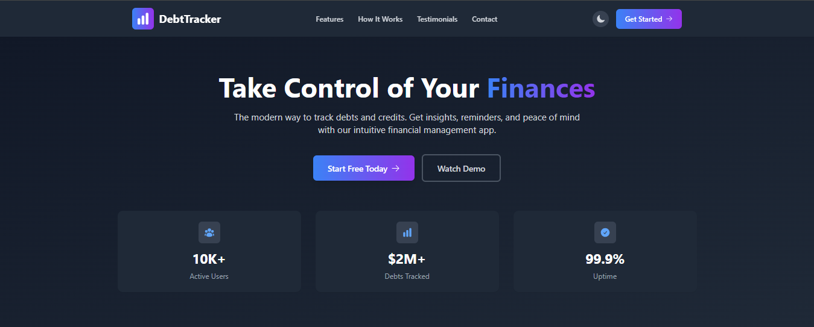

# feature experiment

# 💰 DebtTracker

<div align="center">
  
  <!-- Logo Animation -->
  
  
  <p>
    
    
    
    
  </p>
  
  <p>
    
    
    
    
  </p>
  
  <h3>🚀 Aplikasi Manajemen Keuangan Modern</h3>
  <p><em>Kelola utang & piutang dengan antarmuka yang intuitif dan powerful</em></p>
  
  <p>
    <a href="#-fitur-unggulan">Fitur</a> •
    <a href="#-instalasi">Instalasi</a> •
    <a href="#-dokumentasi">Dokumentasi</a> •
    <a href="#-kontribusi">Kontribusi</a>
  </p>
  
</div>

---

## 🎯 Deskripsi Proyek

**DebtTracker** adalah aplikasi web modern yang dirancang untuk membantu Anda mengelola utang dan piutang dengan efisien. Dengan antarmuka yang intuitif dan fitur-fitur canggih, aplikasi ini mempermudah pelacakan transaksi keuangan pribadi maupun bisnis.

<div align="center">
  
</div>

---

## ✨ Fitur Unggulan

<table>
  <tr>
    <td align="center" width="33%">
      
      <h3>📊 Dashboard Interaktif</h3>
      <p>Ringkasan real-time utang & piutang dengan notifikasi jatuh tempo yang cerdas</p>
    </td>
    <td align="center" width="33%">
      
      <h3>💳 Manajemen Transaksi</h3>
      <p>Kelola utang dan piutang dengan sistem pembayaran sebagian yang fleksibel</p>
    </td>
    <td align="center" width="33%">
      
      <h3>📈 Analisis & Laporan</h3>
      <p>Visualisasi data dengan grafik interaktif dan statistik mendalam</p>
    </td>
  </tr>
</table>

### 🌟 Fitur Lengkap

- 🔐 **Autentikasi Aman** - Sistem login dan registrasi yang aman
- 💰 **Tracking Utang** - Pantau semua utang dengan detail lengkap
- 💳 **Manajemen Piutang** - Kelola piutang dengan mudah
- 📊 **Dashboard Real-time** - Monitoring keuangan secara real-time
- 🔔 **Notifikasi Pintar** - Pengingat jatuh tempo otomatis
- 📈 **Laporan Visual** - Grafik dan chart interaktif
- 👥 **Manajemen Kontak** - Database kontak terintegrasi
- 🏷️ **Kategori Fleksibel** - Organisasi transaksi dengan kategori
- 📱 **Responsive Design** - Tampilan optimal di semua perangkat
- 🎨 **Dark/Light Mode** - Tema yang dapat disesuaikan

---

## 🖥️ Preview Aplikasi

<div align="center">
  
  ### 🏠 Dashboard Overview
  ```
  ┌─────────────────────────────────────────────────────┐
  │  💰 Total Utang: Rp 5.000.000                      │
  │  💳 Total Piutang: Rp 3.000.000                    │
  │  📊 Saldo Bersih: -Rp 2.000.000                    │
  │                                                     │
  │  🔔 Jatuh Tempo Minggu Ini:                         │
  │  • Utang ke Budi - Rp 500.000 (3 hari lagi)        │
  │  • Piutang dari Ani - Rp 200.000 (5 hari lagi)     │
  │                                                     │
  │  [➕ Tambah Utang]  [➕ Tambah Piutang]             │
  └─────────────────────────────────────────────────────┘
  ```
  
  ### 💳 Manajemen Transaksi
  ```
  ┌─────────────────────────────────────────────────────┐
  │  📋 Daftar Utang                                    │
  │  ┌─────────────────────────────────────────────────┐ │
  │  │ 🏪 Toko Budi       | Rp 1.500.000 | 📅 15 Jan   │ │
  │  │ 🏭 Supplier XYZ    | Rp 2.000.000 | 📅 20 Jan   │ │
  │  │ 👨 Pak Joko        | Rp 800.000   | 📅 25 Jan   │ │
  │  └─────────────────────────────────────────────────┘ │
  │                                                     │
  │  [🔍 Cari] [📊 Filter] [📄 Export]                 │
  └─────────────────────────────────────────────────────┘
  ```
  
</div>

---

## 🛠️ Teknologi Stack

<div align="center">
  
  
  
  <table>
    <tr>
      <th>Frontend</th>
      <th>Backend</th>
      <th>UI Framework</th>
      <th>Build Tool</th>
    </tr>
    <tr>
      <td>
        <br>
        
      </td>
      <td>
        <br>
        
      </td>
      <td>
        <br>
        
      </td>
      <td>
        <br>
        
      </td>
    </tr>
  </table>
  
</div>

---

## 🚀 Instalasi

### 📋 Prerequisites

Pastikan Anda memiliki tools berikut:

```bash
# Cek versi Node.js (minimal v16)
node --version

# Cek versi npm
npm --version
```

- ✅ **Node.js** (v16 atau lebih tinggi)
- ✅ **npm** atau **yarn**
- ✅ **Git**

### 🔧 Langkah Instalasi

<details>
<summary>📖 Klik untuk melihat langkah detail</summary>

1. **📥 Clone Repository**

   ```bash
   git clone https://github.com/username/debt-tracker.git
   cd debt-tracker
   ```

2. **📦 Install Dependencies**

   ```bash
   npm install
   # atau menggunakan yarn
   yarn install
   ```

3. **🗄️ Setup JSON Server**

   ```bash
   npm install -g json-server
   ```

4. **🚀 Jalankan Aplikasi**

   **Terminal 1 - Backend (JSON Server):**

   ```bash
   npm run server
   # atau
   json-server --watch db.json --port 3001
   ```

   **Terminal 2 - Frontend (React):**

   ```bash
   npm run dev
   ```

5. **🌐 Akses Aplikasi**
   - **Frontend:** [http://localhost:5173](http://localhost:5173)
   - **API:** [http://localhost:3001](http://localhost:3001)

</details>

---

## 📚 Dokumentasi

### 🏗️ Struktur Proyek

<details>
<summary>📁 Lihat struktur folder lengkap</summary>

```
/debt-tracker/
├── 📁 public/
│   ├── 📄 index.html
│   └── 🖼️ favicon.ico
├── 📁 src/
│   ├── 📁 api/                    # API Layer
│   │   ├── 🔐 authApi.js
│   │   ├── 💰 debtApi.js
│   │   └── 💳 creditApi.js
│   ├── 📁 assets/                 # Static Assets
│   │   ├── 🖼️ images/
│   │   └── 🎯 icons/
│   ├── 📁 components/             # Reusable Components
│   │   ├── 🧩 common/
│   │   │   ├── ⏳ LoadingSpinner.jsx
│   │   │   ├── 🔘 Button.jsx
│   │   │   └── 📝 Modal.jsx
│   │   ├── 🏗️ layout/
│   │   │   ├── 🧭 Navbar.jsx
│   │   │   ├── 📱 Sidebar.jsx
│   │   │   └── 🦶 Footer.jsx
│   │   └── 📊 charts/
│   │       ├── 📈 BarChart.jsx
│   │       ├── 🥧 PieChart.jsx
│   │       └── 📉 LineChart.jsx
│   ├── 📁 context/                # Global State Management
│   │   ├── 🔐 AuthContext.jsx
│   │   ├── 💰 DebtContext.jsx
│   │   └── 🎨 ThemeContext.jsx
│   ├── 📁 hooks/                  # Custom Hooks
│   │   ├── 🎣 useFetch.js
│   │   ├── 🔄 useLocalStorage.js
│   │   └── 📱 useResponsive.js
│   ├── 📁 pages/                  # Page Components
│   │   ├── 🔐 auth/
│   │   │   ├── 🚪 LoginPage.jsx
│   │   │   └── 📝 RegisterPage.jsx
│   │   ├── 📊 dashboard/
│   │   │   └── 🏠 DashboardPage.jsx
│   │   ├── 💰 debts/
│   │   │   ├── 📋 DebtsPage.jsx
│   │   │   ├── ➕ AddDebtPage.jsx
│   │   │   └── 🔍 DebtDetailPage.jsx
│   │   ├── 💳 credits/
│   │   │   ├── 💵 CreditsPage.jsx
│   │   │   └── ➕ AddCreditPage.jsx
│   │   ├── 👥 contacts/
│   │   │   └── 📇 ContactsPage.jsx
│   │   ├── 🏷️ categories/
│   │   │   └── 📂 CategoriesPage.jsx
│   │   └── 📈 reports/
│   │       └── 📊 ReportsPage.jsx
│   ├── 📁 theme/                  # UI Theme Configuration
│   │   ├── 🎨 theme.js
│   │   ├── 🌈 colors.js
│   │   └── 🔤 fonts.js
│   ├── 📁 utils/                  # Helper Functions
│   │   ├── 🔧 formatters.js
│   │   ├── 📅 dateHelpers.js
│   │   └── 🧮 calculations.js
│   ├── 📄 App.jsx                 # Main App Component
│   └── 📄 main.jsx                # Entry Point
├── 📄 db.json                     # JSON Server Database
├── 📄 package.json
├── 📄 vite.config.js
└── 📄 README.md
```

</details>

### 🔀 Routing Structure

```
🏠 / ─────────────────────── Landing Page
├── 🔐 /login ─────────────── Authentication
├── 📝 /register ──────────── User Registration
├── 📊 /dashboard ─────────── Main Dashboard
├── 💰 /debts ─────────────── Debt Management
│   ├── /debts/add ────────── Add New Debt
│   └── /debts/:id ────────── Debt Details
├── 💳 /credits ───────────── Credit Management
│   ├── /credits/add ──────── Add New Credit
│   └── /credits/:id ──────── Credit Details
├── 👥 /contacts ──────────── Contact Management
├── 🏷️ /categories ────────── Category Management
└── 📈 /reports ───────────── Analytics & Reports
```

### 🎨 Component Architecture

<div align="center">
  
</div>

---

## 🎯 Roadmap Development

<div align="center">
  
</div>

### 🌟 Phase 1: Foundation (✅ Completed)

- [x] 🏗️ Project setup dan struktur
- [x] 🔐 Authentication system
- [x] 💾 Database design
- [x] 🎨 UI/UX design system

### 🚀 Phase 2: Core Features (🔄 In Progress)

- [x] 📊 Dashboard implementation
- [x] 💰 Debt management CRUD
- [x] 💳 Credit management CRUD
- [ ] 💸 Payment tracking system
- [ ] 🔔 Notification system

### 💎 Phase 3: Advanced Features (📅 Planned)

- [ ] 📈 Advanced analytics
- [ ] 📱 PWA capabilities
- [ ] 🌙 Dark mode theme
- [ ] 📤 Data export/import
- [ ] 🔄 Real-time updates

### 🌈 Phase 4: Enhancement (🎯 Future)

- [ ] 📱 Mobile app version
- [ ] 🔗 API integration
- [ ] 🤖 AI-powered insights
- [ ] 🌐 Multi-language support

---

## 🎨 Animasi dan Interaksi

### ✨ Animasi yang Tersedia

<div align="center">
  
</div>

- 🎭 **Framer Motion** untuk animasi page transitions
- 🎨 **CSS Animations** untuk hover effects
- ⚡ **Loading Spinners** yang smooth
- 🌊 **Fade In/Out** animations
- 🎪 **Bouncing Buttons** untuk interaksi

### 🖱️ Interactive Elements

- 🔘 **Button Animations** - Hover dan click effects
- 📊 **Chart Animations** - Data visualization yang smooth
- 🎯 **Modal Transitions** - Smooth popup animations
- 📱 **Responsive Animations** - Adaptif untuk semua device

---

## 📊 Stats & Analytics

<div align="center">
  
  
</div>

---

## 🤝 Kontribusi

Kontribusi sangat diterima! Mari bergabung dalam mengembangkan DebtTracker.

<div align="center">
  
</div>

### 🛠️ Cara Berkontribusi

1. 🍴 **Fork** repository ini
2. 🌟 **Buat branch** fitur baru
   ```bash
   git checkout -b feature/amazing-feature
   ```
3. 💻 **Commit** perubahan Anda
   ```bash
   git commit -m 'Add: amazing feature'
   ```
4. 📤 **Push** ke branch
   ```bash
   git push origin feature/amazing-feature
   ```
5. 🔄 **Create Pull Request**

### 📋 Contribution Guidelines

- 📝 Tulis kode yang bersih dan terdokumentasi
- 🧪 Tambahkan test untuk fitur baru
- 📖 Update dokumentasi jika diperlukan
- 🎯 Ikuti coding standards yang ada

---

## 🐛 Bug Reports & Feature Requests

<div align="center">
  <a href="https://github.com/username/debt-tracker/issues/new?assignees=&labels=bug&template=bug_report.md&title=%5BBUG%5D">
    
  </a>
  <a href="https://github.com/username/debt-tracker/issues/new?assignees=&labels=enhancement&template=feature_request.md&title=%5BFEATURE%5D">
    
  </a>
</div>

---

## 📄 License

<div align="center">
  
  Distributed under the **MIT License**. See `LICENSE` for more information.
  
  
  
</div>

---

## 📞 Contact & Support

<div align="center">
  
  
  
  <p>
    <a href="https://github.com/username">
      
    </a>
    <a href="https://linkedin.com/in/username">
      
    </a>
    <a href="mailto:your.email@example.com">
      
    </a>
    <a href="https://twitter.com/username">
      
    </a>
  </p>
  
</div>

---

## 🎉 Acknowledgments

<div align="center">
  
  **Terima kasih kepada semua yang telah berkontribusi!**
  
  
  
  ### 🌟 Special Thanks
  - 💖 **React Community** - For the amazing ecosystem
  - 🎨 **Chakra UI Team** - For the beautiful components
  - 📊 **Recharts** - For the stunning data visualizations
  - 🚀 **Vite Team** - For the lightning-fast build tool
  
  
  
  
  
</div>

---

<div align="center">
  
  
  
  <h3>🎯 Kelola Keuangan Anda dengan Lebih Baik Hari Ini!</h3>
  
  <br>
  
  <sub>Built with ❤️ by <strong>NOVAL</strong></sub>
  
</div>

<!-- # 💸 DebtTrackerApp

Aplikasi web modern untuk mencatat, memantau, dan mengelola **utang & piutang pribadi maupun bisnis** dengan mudah, cepat, dan aman. Cocok untuk keperluan pribadi, keluarga, atau tim kecil.



---

## 🚀 Fitur Utama

- ✅ **Form Transaksi Dinamis**: Catat utang atau piutang dalam satu form gabungan.
- 📊 **Dashboard Interaktif**: Tampilkan ringkasan saldo, total utang/piutang, dan status terkini.
- 🧠 **Perhitungan Otomatis**: Saldo bersih dihitung otomatis berdasarkan seluruh transaksi.
- ⏳ **Status Transaksi**: Tandai utang/piutang sebagai `Belum Lunas` atau `Lunas` lengkap dengan tanggal penyelesaian.
- 🔎 **Filter & Laporan**: Pantau transaksi berdasarkan status atau kategori.
- 🌗 **Mode Gelap**: UI yang nyaman digunakan siang dan malam.

---

## 🛠️ Teknologi yang Digunakan

- **Vite + React.js** — Untuk performa frontend yang cepat dan modular.
- **Tailwind CSS** — Styling modern dan konsisten.
- **React Icons** — Ikon responsif dan elegan.
- **Toastify** — Notifikasi interaktif.
- **localStorage / JSON Server** — Penyimpanan data sementara atau simulasi backend.

---

## 📈 Rencana Pengembangan

- 🔐 _ Autentikasi multi-user_ \_
- 📱 _ Versi mobile responsif_ \_
- 📅 _ Notifikasi pengingat jatuh tempo_ \_ -->
